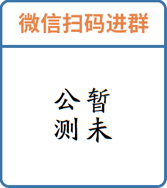

# LegendWechatBot 🤖


```
██╗     ███████╗ ██████╗ ███████╗███╗   ██╗██████╗ 
██║     ██╔════╝██╔════╝ ██╔════╝████╗  ██║██╔══██╗
██║     █████╗  ██║  ███╗█████╗  ██╔██╗ ██║██║  ██║
██║     ██╔══╝  ██║   ██║██╔══╝  ██║╚██╗██║██║  ██║
███████╗███████╗╚██████╔╝███████╗██║ ╚████║██████╔╝
╚══════╝╚══════╝ ╚═════╝ ╚══════╝╚═╝  ╚═══╝╚═════╝ 
```

**基于 [WCFerry](https://github.com/lich0821/WeChatFerry) 的插件化微信机器人**
**详细介绍请参见 [github博客](https://kanwuqing.github.io) 或 [gitlab博客](https://kanwuqing.gitlab.io)**

## ⚠️ 免责声明

* 在下文中, 若无特殊说明, "此项目"均指「[LegendWechatBot](https://github.com/kanwuqing/LegendWechatBot)」
* 🆓 此项目完全免费开源, 无任何收费内容
* 📚 此项目仅供学习交流与技术研究, 严禁用于商业或非法用途
* ⚖️ 作者不对项目的安全性、完整性及有效性作任何担保, 使用者需自行承担风险
* 🔄 作者保留随时修改、更新或终止项目的权利, 恕不另行通知
* 👮♂️ 使用者需遵守当地法律法规, 尊重微信平台规则及用户隐私
* 📜 二次开发时须遵守 GPL3.0 协议, 注明原始项目出处, 禁止闭源
* ⚠️ 详细条款请参阅 [LICENSE](./LICENSE) 文件

## 💬 微信交流群

<div align="center">
  
</div>

## 🎯 功能清单

### ⚙️ 框架核心功能

> LegendBot 集成开箱即用的基础能力, 开发者可快速调用核心 API

<details>
  <summary>展开查看</summary>
  <ul>
    <li>主框架 - 核心功能集成与生命周期管理</li>
    <li>配置集成 - 统一化配置管理系统</li>
    <li>消息系统集成 - 多类型消息收发管道</li>
    <li>事件监听 - 实时事件响应机制</li>
    <li>日志管理 - 多级日志记录与分析</li>
    <li>数据库管理 - 数据持久化解决方案</li>
    <li>文件管理 - 资源文件统一存储方案</li>
  </ul>
</details>

### 📨 消息系统

> 支持 16+ 种消息类型处理, 打造全场景交互体验

<details>
  <summary>展开查看 (i: 输入功能; o: 输出功能)</summary>
  <ul>
    <li>好友申请(i) - 自动处理好友请求</li>
    <li>系统消息(i) - 平台通知消息解析</li>
    <li>文本消息(io) - 支持 Markdown/Emoji 格式</li>
    <li>多媒体消息(io) - 图片/语音/视频/文件收发</li>
    <li>位置消息(i) - 地理坐标解析 (开发中)</li>
    <li>链接消息(io) - 智能链接预览功能</li>
    <li>小程序消息(io) - 完整结构解析能力</li>
    <li>红包消息(i) - 自动提醒与统计</li>
    <li>转账消息(io) - 安全交易处理机制</li>
    <li>群管理功能 - 成员/公告/名片管理</li>
  </ul>
</details>

### 📅 事件系统

> 8+ 种事件监听类型, 构建智能响应体系

<details>
  <summary>展开查看</summary>
  <ul>
    <li>好友申请事件 - 自定义审批流程</li>
    <li>好友添加事件 - 自动欢迎机制</li>
    <li>消息监听事件 - 实时内容监控</li>
    <li>群成员事件 - 成员变动追踪</li>
    <li>定时任务事件 - 自动化工作流</li>
    <li>频率控制事件 - API/消息频率管控</li>
    <li>敏感词事件 - 内容安全过滤</li>
  </ul>
</details>

### 🔌 插件系统

> 模块化扩展设计, 轻松打造个性功能

<details>
  <summary>展开查看</summary>
  <ul>
    <li>插件管理 - 热插拔式组件管理</li>
    <li>插件模板 - 快速开发脚手架</li>
    <li>自动审批 - 智能好友申请处理</li>
    <li>欢迎助手 - 新成员引导系统</li>
    <li>中医诊断 - 中医问诊机器人</li>
    <li>张维为表情 - 文字查询张维为表情包</li>
    <li>表情包生成 - 传入图片生成表情包</li>
  </ul>
</details>

## 🚀 部署指南

### Docker 部署
📦 推荐容器化方案 → [XYBot V2 Docker 指南](https://github.com/HenryXiaoYang/XYBotV2?tab=readme-ov-file#-docker-%E9%83%A8%E7%BD%B2%E6%8E%A8%E8%8D%90)

### Linux 部署
🐧 Linux方案 → [XYBot V2 Linux 指南](https://github.com/HenryXiaoYang/XYBotV2?tab=readme-ov-file#-linux-%E9%83%A8%E7%BD%B2%E6%AD%A5%E9%AA%A4)

### Mac 部署
🍎 MacOS方案 → [XYBot V2 Mac 指南](https://github.com/HenryXiaoYang/XYBotV2)

### Windows 部署

#### 1️⃣ 环境准备
- 安装 [Python](https://www.python.org/downloads/)
  - 勾选 "Add Python to PATH"

#### 2️⃣ 项目初始化
```bash
git clone https://github.com/kanwuqing/LegendWechatBot.git
cd LegendWechatBot && python -m venv venv
.\venv\Scripts\activate && pip install -r requirements.txt
```

#### 3️⃣ 启动机器人
```bash
python main.py
```

#### 4️⃣ 配置调整
📝 主配置: config/config.yaml
📝 各插件配置: plugins/<插件名>/config.yaml

这几个插件需要配置API密钥才可正常工作:

- 暂无


如果机器人正在运行, 需要重启才能使主配置生效：
```bash
# 按Ctrl+C停止机器人
# 重新启动
python main.py
```

> [!TIP]
> 如果是修改插件配置则可使用热加载、热卸载、热重载指令, 不用重启机器人

## ❓ 常见问题

### Wcf 框架问题
🔍 参见 [WechatFerry](https://github.com/lich0821/WeChatFerry/issues/) 的issues

### LegendBot 问题
📮 欢迎提交 Issues 反馈

## 👥 贡献指南

### 🚩 提交代码时请使用标准化 Commit Message：
- `feat`: 新功能
- `fix`: Bug修复
- `docs`: 文档更新
- `style`: 代码格式
- `ref`: 代码重构
- `perf`: 性能优化
- `test`: 测试相关
- `chore`: 构建/工具变更

### 提交贡献步骤
- **Fork项目仓库**：在GitHub上找到你想要贡献的项目，点击项目页面上的"Fork"按钮
- **克隆仓库到本地**：使用git clone命令将你Fork的项目克隆到本地
- **创建新分支**：在本地仓库中创建一个新分支进行你的工作，这是一个良好的实践。使用git checkout -b branch-name创建并切换到新分支
- **提交更改**：使用git add和git commit命令提交你的更改
- **推送更改到GitHub**：使用git push origin branch-name将更改推送回你的GitHub仓库
- **创建Pull Request**：在GitHub上，你会看到一个"Compare & pull request"按钮。点击它，填写PR的标题和描述，然后提交


## ❤️ 支持作者

🌟 如果项目对您有帮助, 欢迎：
- 在 GitHub 点亮 ⭐ [项目主页](https://github.com/kanwuqing/LegendWechatBot)
- 通过 [爱发电⚡](https://ifdian.net/a/kanwuqing) 支持开发